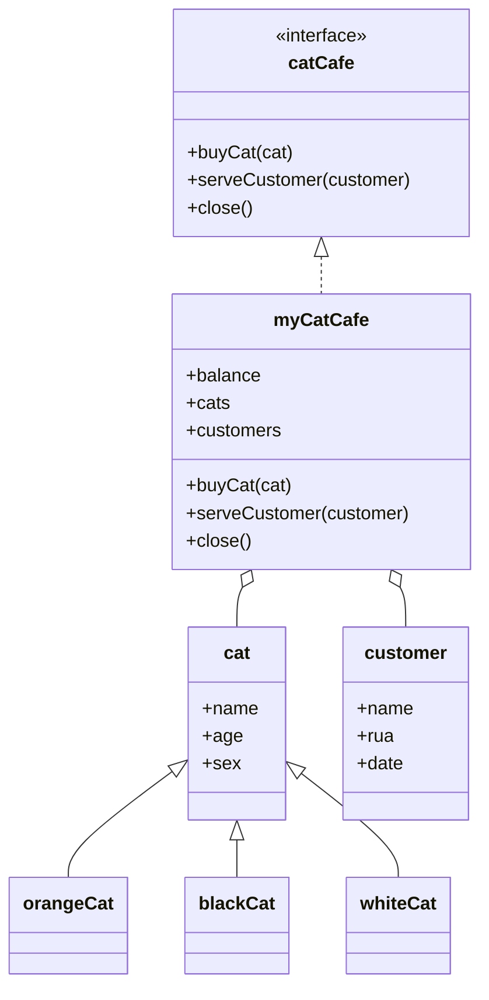
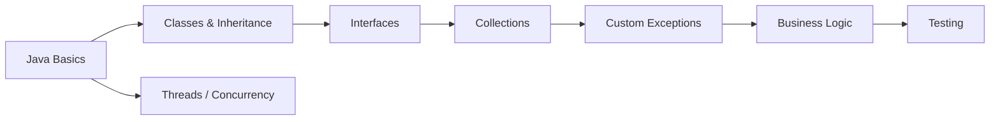

# West2 Java Practice
### Object-Oriented Programming, Exception Handling, Collections, and Multithreading

## Overview

This repository archives an early set of Java exercises completed during **West2 Online** training. The main exercise is a small **Cat Cafe** domain model used to practice object-oriented programming, inheritance, interfaces, collections, custom exceptions, and basic business logic. A separate `multiThreads.java` exercise records early practice with Java concurrency.

## Cat Cafe Design

The exercise models a cafe that owns cats, serves customers, buys new cats from its balance, and calculates daily revenue.

## Main Behaviors

### Buying Cats

`myCatCafe.buyCat()` checks the concrete cat type, adds the cat to the cafe collection when the current balance is sufficient, and deducts the corresponding price. Insufficient funds trigger the custom `insufficientBalanceException`.

### Serving Customers

`serveCustomer()` records the customer, verifies that at least one cat is available, randomly selects a cat for the customer, and updates the cafe balance according to the customer's interaction count. If there are no cats, `catNotFoundException` is thrown.

### Closing the Cafe

`close()` iterates through customers served on the current day, prints their information, and calculates the day's revenue.

## Source Files

| File | Purpose |
| --- | --- |
| `cat.java` | Base cat abstraction |
| `orangeCat.java` | Orange-cat specialization |
| `blackCat.java` | Black-cat specialization |
| `whiteCat.java` | White-cat specialization |
| `customer.java` | Customer information and visit state |
| `catCafe.java` | Cafe interface |
| `myCatCafe.java` | Main cafe implementation |
| `catNotFoundException.java` | Custom exception for empty cafe |
| `insufficientBalanceException.java` | Custom exception for insufficient balance |
| `testCatCafe.java` | Cat-cafe test / demonstration code |
| `multiThreads.java` | Separate multithreading exercise |

## Learning Topics

The repository is useful as a snapshot of early Java practice in:

- inheritance and polymorphism;
- interfaces and implementations;
- `ArrayList`-based object management;
- custom checked/runtime exception handling;
- date handling with `LocalDate`;
- random selection and simple state updates;
- multithreaded programming concepts.

## Running

The original source uses a Java package declaration (`TEST_2_1`), so place the files under a matching package directory or import them into an IDE project with the corresponding package structure. Compile and run `testCatCafe.java` for the cafe exercise and `multiThreads.java` for the concurrency exercise.

## Notes

This is a historical training repository rather than production software. Naming conventions and package organization are intentionally kept close to the original submission so the repository reflects the learning process at that time.

## Author

**Bo Liu**  
Contact: `liubo317@hnu.edu.cn`  
Homepage: https://boliupro.github.io
